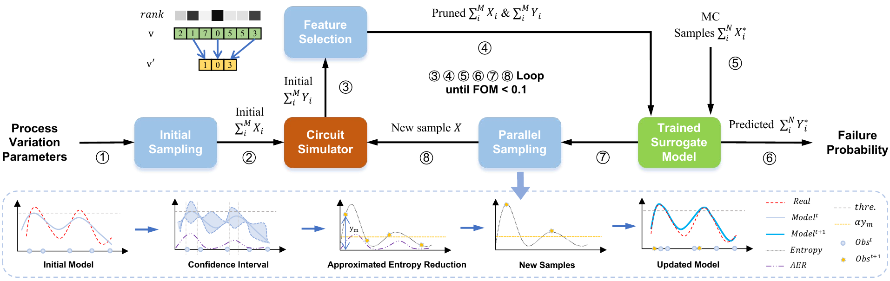

# ASDK——Absolute Shrinkage Deep Kernel Learning

## Authors:

+ [Shuo Yin](https://sawydust1228.github.io/)
+ Guohao Dai
+ [Wei W.Xing](https://wayxing.github.io/)

## Introduction:

This repo contains implementation of our yield estimation algorithm, which described in the paper *"High Dimensional Yield Estimation using Shrinkage Deep Features and Maximization of Integral Entropy Reduction"* (ASP-DAC 2023).

The main work flow of this work is given by the following figure.




## Dependency

+ Python
+ Pytorch
+ Numpy
+ Pandas
+ Gpytorch
+ tqdm
+ pyHSICLasso

To pull this repo, you can run the following command.

```shell
git clone git@github.com:SawyDust1228/HSIC-DKL-Yield-Estimation.git
```

You can use the following command to  install all the necessary packages.

```shell
git pip install -r requirements.txt
```


